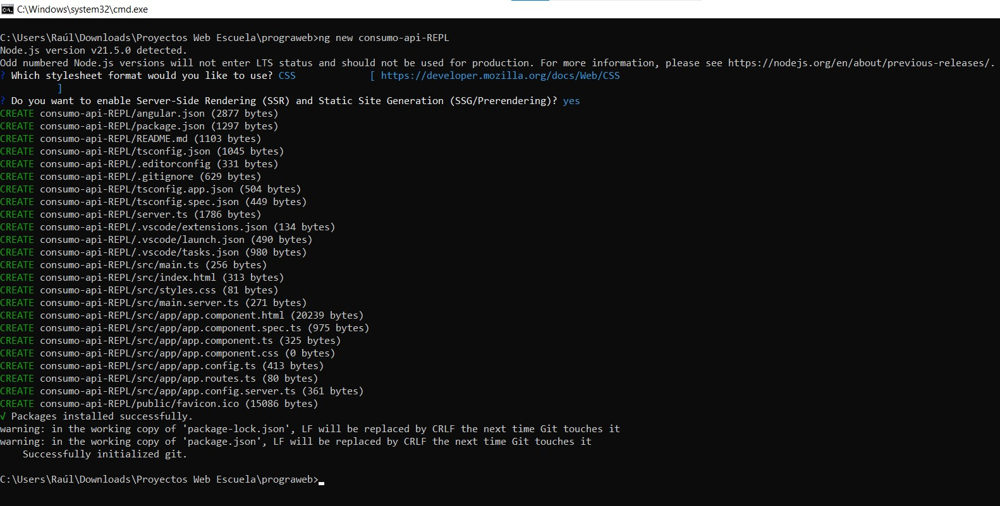
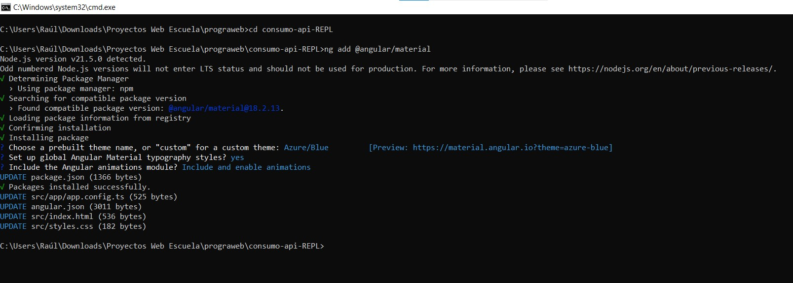
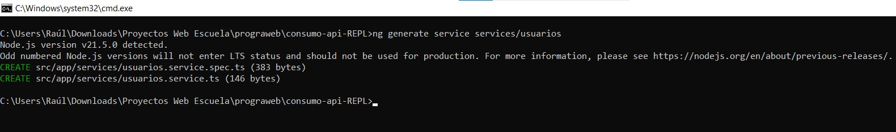
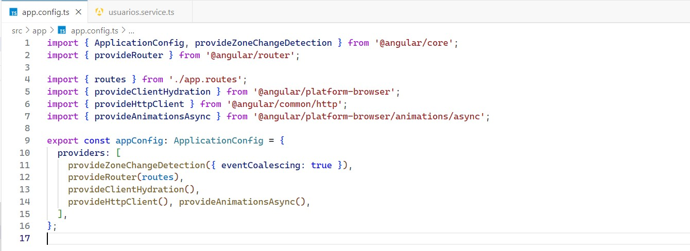
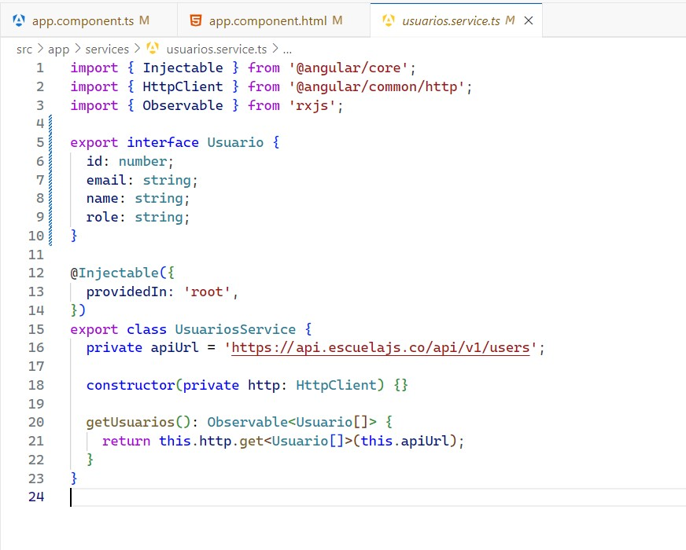
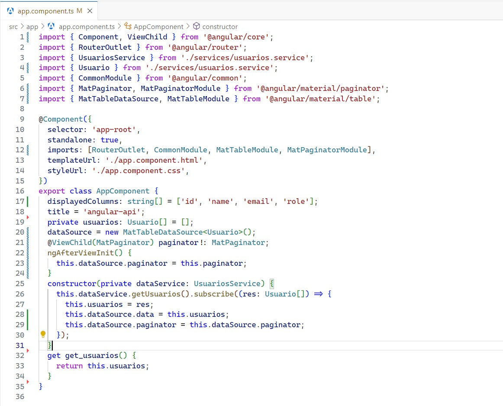
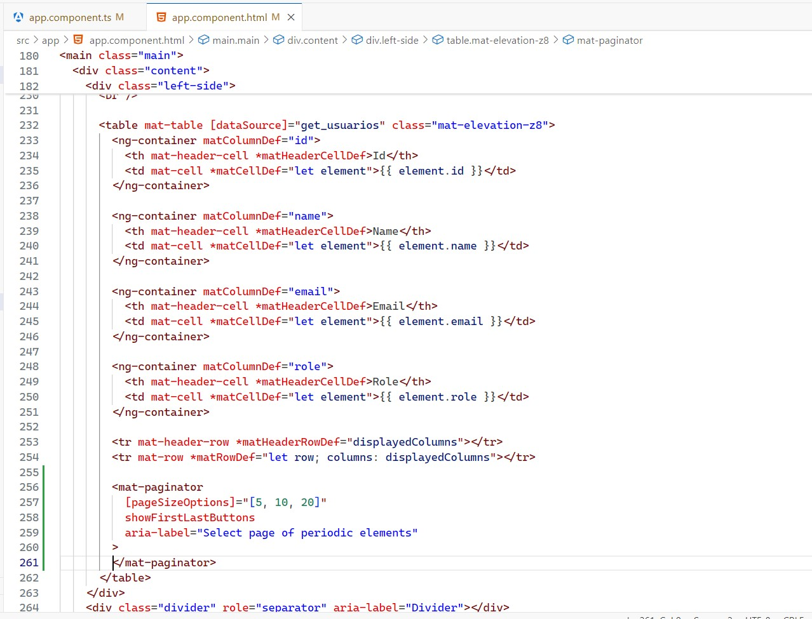
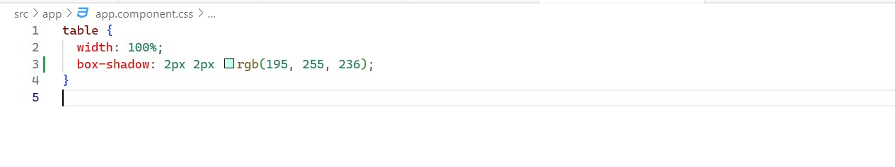
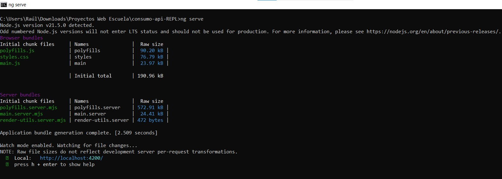
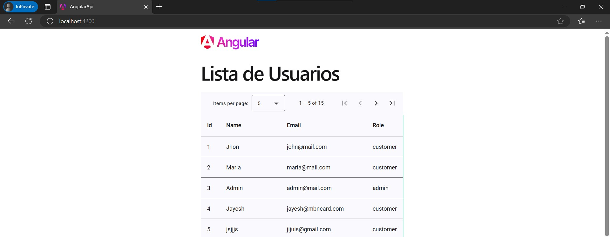

# Consumo de API de terceros

### Raúl Emiliano Pérez López

### Descripción del Proyecto

# Consumo de API de Terceros con Angular y Angular Material

Este proyecto consiste en el desarrollo de una aplicación web basada en Angular que consume una API pública que devuleve información de usuarios. Se utiliza la API proporcionada por [API de Escuela](https://api.escuelajs.co/) en su endpoint `https://api.escuelajs.co/api/v1/users` para obtener información de usuarios y mostrarlos en una tabla paginada.

#### Características principales:
- **Consumo de API REST:** Se realiza una solicitud HTTP GET al endpoint de usuarios para obtener los datos.
- **Angular Material:** Se utiliza Angular Material para la construcción de una tabla estilizada y funcional.
- **Paginación:** La tabla incorpora un sistema de paginación dinámico que permite navegar entre diferentes páginas de resultados.
- **Modularidad:** Código estructurado siguiendo las mejores prácticas de Angular, con componentes reutilizables y servicios centralizados para el consumo de la API.

#### Tecnologías Utilizadas:
- **Angular**: Framework para el desarrollo de aplicaciones web SPA.
- **Angular Material**: Biblioteca de componentes UI basados en Material Design.
- **HttpClientModule**: Módulo de Angular para manejar solicitudes HTTP.
- **TypeScript**: Lenguaje principal para el desarrollo en Angular.
- **CSS**: Para estilos de los elementos HTML

#### Estructura del Proyecto:
1. **Componente de Tabla:** 
   - Presenta los datos obtenidos de la API en una tabla interactiva.
   - Incorpora paginación y estilos consistentes.
2. **Servicio de Usuarios:** 
   - Gestiona las solicitudes HTTP al endpoint de la API.
   - Facilita la reutilización y separación de responsabilidades.
3. **Módulo de Material:** 
   - Centraliza los módulos de Angular Material necesarios para la aplicación, como tablas, paginación, botones y estilos.

#### Flujo del Proyecto:
1. **Consumo de API:**
   - Se utiliza el servicio de Angular para realizar una solicitud GET al endpoint de usuarios.
2. **Renderizado de Datos:**
   - Los datos obtenidos se pasan al componente de tabla para ser mostrados.
3. **Interacción:**
   - El usuario puede navegar entre las páginas de resultados utilizando la paginación integrada.

#### Objetivo:
El objetivo principal de este proyecto es demostrar el consumo eficiente de una API REST utilizando Angular, la presentación de datos en un formato interactivo y el uso de herramientas modernas de UI como Angular Material.

--- 

### Paso 1: Creación del Proyecto

Para iniciar el proyecto, se utiliza Angular CLI, una herramienta que facilita la creación y configuración inicial de aplicaciones Angular. Sigue los pasos a continuación para crear el proyecto:

#### Comando para crear el proyecto
Se ejecuta el siguiente comando en tu terminal para generar una nueva aplicación Angular

#### Detalles del Comando:
- `ng new`: Comando de Angular CLI para crear un nuevo proyecto.
- `consumo-api-REPL`: Nombre del proyecto. Este será el directorio que contendrá todos los archivos y configuraciones del proyecto.

#### Proceso involucrado durante la ejecución:
1. **Seleccionar configuraciones:**
   - **¿Quieres agregar Angular Routing?**  
     Se eelecciona `Yes` para incluir el módulo de routing si se requiere en el futuro para navegación entre vistas.
   - **Seleccionar el estilo predeterminado:**  
     Se elige `CSS` para manejar los estilos de los elementos.

2. **Generación del proyecto:**
   Angular CLI creará automáticamente la estructura de carpetas, configuraciones iniciales y descargará las dependencias necesarias.

#### Resultado:
Después de completar el proceso, se obtiene una nueva carpeta llamada `consumo-api-REPL`, que contiene la estructura básica del proyecto Angular.

### Paso 2: Instalación de Angular Material

Angular Material es una biblioteca de componentes de UI que sigue las directrices de Material Design. Proporciona componentes como tablas, botones, formularios, y más, que pueden ser utilizados para crear interfaces modernas y atractivas. En este paso, se va a instalar Angular Material en el proyecto.

#### Procesos involucrados durante la instalación:
1. **Selección de un tema:**
   El comando te pedirá que elijas un tema prediseñado de Angular Material. Yo escogí el siguiente
   - **Azure/Blue** (tema por defecto)

2. **Configuración de animaciones:**
   Angular Material requiere que el módulo `BrowserAnimationsModule` esté habilitado para poder usar animaciones. El comando agregará automáticamente este módulo al archivo `app.module.ts`.

3. **Instalación de dependencias:**
   Angular CLI descargará e instalará todas las dependencias necesarias de Angular Material y las agregará a tu archivo `package.json`.

#### Resultado:
Al finalizar, el proyecto estará listo para usar los componentes de Angular Material. El archivo `angular.json` se actualizará con las configuraciones del tema seleccionado, y el archivo `app.module.ts` tendrá las importaciones necesarias para empezar a utilizar los componentes de Material.

### Paso 3: Generación del Servicio de Usuarios

En este paso, se crea un servicio en Angular que se encargue de la comunicación con la API para obtener la lista de usuarios. Un servicio en Angular es una clase que se utiliza para compartir funcionalidades y manejar lógica de negocio, como las solicitudes HTTP.

#### Detalles del Comando:
- `ng generate service`: Comando de Angular CLI para generar un nuevo servicio.
- `services/usuarios`: Especifica la ruta y el nombre del servicio. En este caso, el servicio se creará en la carpeta `src/app/services` y se llamará `usuarios.service.ts`.

#### Explicación:
- **Estructura del servicio:** Angular CLI generará automáticamente una clase de servicio con los métodos básicos. Este servicio se encargará de realizar las solicitudes HTTP para obtener los datos de la API.
- **Ubicación:** El servicio se guardará en la carpeta `src/app/services` y tendrá el archivo `usuarios.service.ts`.

#### Resultado:
Al finalizar, Angular CLI creará un archivo llamado `usuarios.service.ts`.

### Paso 4: Agregar `provideHttpClient` a la Configuración en `app.config.ts`

En este paso, vamos a asegurarnos de que la aplicación esté configurada para poder realizar solicitudes HTTP utilizando el `HttpClientModule`. Angular, a partir de la versión 14, permite usar un enfoque más modular y explícito para configurar las dependencias en la aplicación, utilizando la configuración `ApplicationConfig`.

#### Agregar proveedor de cliente HTTP 

En el archivo `app.config.ts` se va a agregar `provideHttpClient` dentro de los proveedores, lo que permitirá que los servicios de nuestra aplicación (como el servicio de usuarios que creamos en el paso anterior) realicen solicitudes HTTP.

El archivo `app.config.ts` tiene el siguiente código:

#### Explicación del código:
- **`provideHttpClient()`**: Este es el proveedor necesario para habilitar el `HttpClient` en la aplicación. Sin esto, Angular no podrá realizar solicitudes HTTP utilizando el servicio `HttpClient` que se inyectó en el servicio `usuarios.service.ts`.
- **Otros proveedores**:
  - **`provideZoneChangeDetection()`**: Este proveedor se utiliza para mejorar el rendimiento de la detección de cambios en la aplicación, al agrupar eventos en "zonas".
  - **`provideRouter(routes)`**: Configura las rutas de la aplicación, necesarias si se está utilizando el enrutador en Angular.
  - **`provideClientHydration()`**: Se utiliza en aplicaciones que tienen renderizado del lado del servidor (SSR) para hidratar el estado del cliente.
  - **`provideAnimationsAsync()`**: Proporciona soporte para animaciones asíncronas en la aplicación, requerido si se utiliza Angular Material u otras librerías que hagan uso de animaciones.

### Paso 5: Configuración del Servicio de Usuarios

En este paso, configuramos el servicio de usuarios para que pueda obtener los usuarios desde la API y ofrecerlos a los componentes que los necesiten. Vamos a modificar el archivo `usuarios.service.ts` para agregar la lógica de obtención de usuarios, así como definir una interfaz que representará la estructura de los datos que recibimos desde la API.

#### Código del servicio `usuarios.service.ts`

El archivo `src/app/services/usuarios.service.ts` tendrá el siguiente código que se muestra en la imagen.

#### Explicación del código:

1. **Interfaz `Usuario`:**
   - La interfaz `Usuario` define la estructura de un usuario tal como la esperamos de la API. Cada usuario tendrá los siguientes campos:
     - `id`: Número único que identifica al usuario.
     - `email`: Dirección de correo electrónico del usuario.
     - `name`: Nombre completo del usuario.
     - `role`: Rol del usuario (por ejemplo, 'admin', 'user', etc.).

2. **Servicio `UsuariosService`:**
   - **`apiUrl`:** Es la URL de la API que devuelve la lista de usuarios.
   - **Método `getUsuarios`:** Este método utiliza el `HttpClient` de Angular para hacer una solicitud HTTP GET al endpoint de la API. Devuelve un `Observable` de tipo `Usuario[]`, lo que significa que se espera una lista de usuarios como respuesta.
   - **`HttpClient`:** Angular maneja las solicitudes HTTP a través de este servicio, que es inyectado en el constructor de la clase para poder usarse en el método `getUsuarios`.

#### Explicación adicional:

- **`Observable<Usuario[]>`:** El método `getUsuarios` devuelve un `Observable`, que es un patrón usado en Angular para manejar datos asincrónicos. Los componentes que usen este servicio deberán suscribirse al `Observable` para recibir los datos de los usuarios cuando estén disponibles.

### Paso 6: Configuración del Componente en `app.component.ts`

En este paso, configuramos el componente `AppComponent` para que obtenga los usuarios desde el servicio `UsuariosService` y los muestre en una tabla utilizando Angular Material. También implementamos la paginación para que los usuarios se puedan navegar página por página.

#### Código del Componente `app.component.ts`

A continuación, se detalla el código completo del componente `AppComponent` en la siguiente imagen.

#### Explicación del código:

1. **Dependencias Importadas:**
   - **`MatTableDataSource` y `MatTableModule`:** Se utilizan para la implementación de la tabla de Material, que mostrará los usuarios. `MatTableDataSource` es una clase que facilita la gestión de los datos en la tabla.
   - **`MatPaginator` y `MatPaginatorModule`:** Permiten implementar la paginación en la tabla. El `MatPaginator` es un componente que permite dividir los datos en páginas.

2. **Propiedades del componente:**
   - **`displayedColumns`:** Define las columnas que se mostrarán en la tabla. En este caso, las columnas son `id`, `name`, `email`, y `role`.
   - **`usuarios`:** Lista privada que almacenará los datos de los usuarios obtenidos desde la API.
   - **`dataSource`:** Es una instancia de `MatTableDataSource` que maneja los datos de la tabla y la paginación.
   - **`paginator`:** Una referencia al paginador que se vincula a la tabla para permitir la navegación entre páginas.

3. **`ngAfterViewInit()`:** Este método se ejecuta después de que las vistas del componente hayan sido inicializadas. Aquí, se asegura de que el paginador esté asociado correctamente con el `dataSource` para habilitar la paginación.

4. **`constructor`:**
   - El servicio `UsuariosService` se inyecta en el constructor y se utiliza para obtener los datos de los usuarios. 
   - Al suscribirse a `getUsuarios()`, los usuarios se reciben como un array de objetos `Usuario[]`. Los datos se asignan a `this.usuarios` y se actualiza `this.dataSource.data` para que la tabla muestre los usuarios obtenidos.

5. **Getter `get_usuarios`:** Permite acceder a la lista de usuarios desde el componente. Aunque no es estrictamente necesario para este caso, puede ser útil si se quiere acceder a los usuarios desde otras partes de la plantilla o del componente.

### Paso 7: Agregar el Código HTML en `app.component.html`

En este paso, vamos a configurar el archivo `app.component.html` para que muestre la tabla de usuarios utilizando Angular Material y habilite la paginación para navegar entre los registros.

El código HTML para el componente será el de la siguiente imagen.

#### Explicación del código:

1. **`mat-table`**: Se utiliza el componente `mat-table` de Angular Material para crear una tabla. La propiedad `[dataSource]` se enlaza con la lista de usuarios obtenida desde el servicio (`get_usuarios`), que es un getter del componente.

2. **Definición de columnas (`ng-container`)**:
   - Cada columna se define usando el componente `ng-container` y el atributo `matColumnDef`. Esto permite que las celdas de la tabla sean dinámicas.
   - Para cada columna, se especifica un `mat-header-cell` para el encabezado y un `mat-cell` para las celdas. Las columnas definidas son:
     - `id`: Muestra el identificador único del usuario.
     - `name`: Muestra el nombre del usuario.
     - `email`: Muestra la dirección de correo electrónico del usuario.
     - `role`: Muestra el rol del usuario (por ejemplo, "admin", "user", etc.).

3. **Filas de la tabla**:
   - `<tr mat-header-row *matHeaderRowDef="displayedColumns"></tr>`: Esta fila define las cabeceras de la tabla.
   - `<tr mat-row *matRowDef="let row; columns: displayedColumns"></tr>`: Esta fila se usa para mostrar los datos de cada usuario.

4. **Paginación (`mat-paginator`)**:
   - **`[pageSizeOptions]`:** Define las opciones de tamaño de página disponibles para la paginación. En este caso, el usuario puede elegir entre 5, 10 o 20 elementos por página.
   - **`showFirstLastButtons`:** Muestra los botones para ir a la primera y última página.
   - **`aria-label`:** Proporciona una etiqueta accesible para describir el propósito del componente.

### Paso 8: Agregar el CSS para el Componente

En este paso, vamos a agregar el estilo CSS para el componente de la tabla en el archivo `app.component.css` para darle un diseño más atractivo y mejorar su apariencia.

El código CSS será el siguiente:

#### Explicación del CSS:

1. **Estilo para la tabla (`table`)**:
   - **`width: 100%`:** La tabla ocupa todo el ancho disponible del contenedor.
   - **`box-shadow: 2px 2px rgb(195, 255, 236);`:** Se agrega una sombra de un color verde suave con un pequeño desplazamiento para darle un efecto visual.

### Paso 9: Ejecutar el Comando `ng serve`

En este paso, vamos a ejecutar la aplicación Angular para ver el resultado y asegurarnos de que todo funcione correctamente.

#### Explicación:
- **`ng serve`**: Este comando compila y sirve la aplicación en un servidor de desarrollo local. Una vez ejecutado, Angular compilará el proyecto y lo pondrá en marcha en el servidor de desarrollo.
- El servidor de desarrollo se ejecuta en **http://localhost:4200**, por lo que se podrá acceder a la aplicación desde un navegador.

### Paso 10: Ver los Resultados en **http://localhost:4200**

Se tiene verificar que todo esté funcionando correctamente accediendo a la aplicación desde el navegador.

