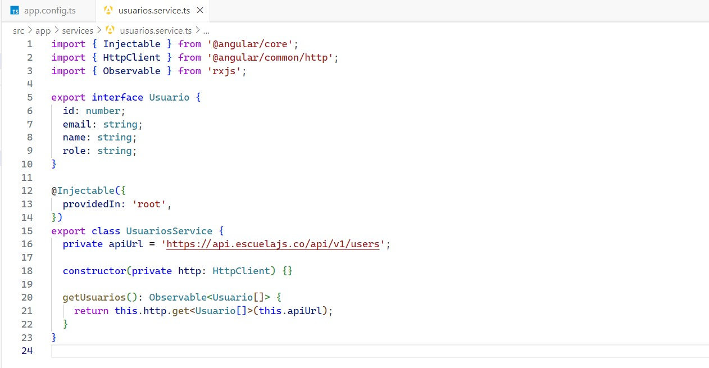

# Consumo de API de terceros

### Raúl Emiliano Pérez López

## Paso 1. Crear proyecto

## Paso 2. Ir a la ruta del proyecto

## Paso 3. Generar servicio de usuarios

## Paso 4. Configurar HTTPClient del proyecto

## Paso 5. Generar código de servicio de usuarios

## Paso 6. Crear tabla en HTML

## Paso 7. Configurar el componente

## Paso 8. Configurar CSS

